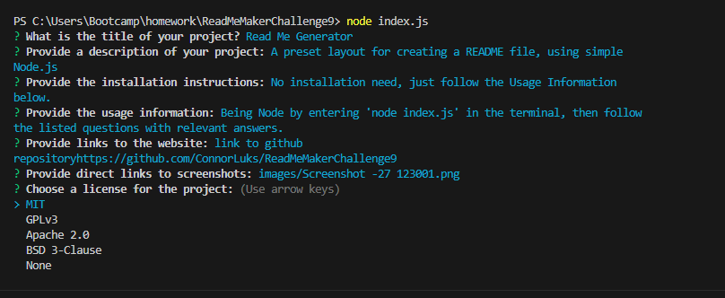
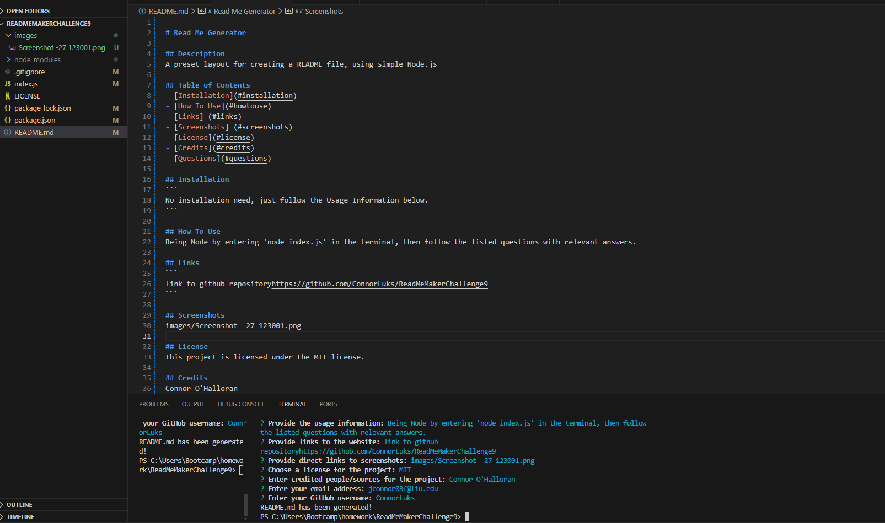

# Read Me Generator

## Description
A preset layout for creating a README file, using simple Node.js

## Table of Contents
- [Installation](#installation)
- [How To Use](#howtouse)
- [Links] (#links)
- [Screenshots] (#screenshots)
- [License](#license)
- [Credits](#credits)
- [Questions](#questions)

## Installation
No Installation needed, just follow the Usage Information below.

## How To Use
Being Node by entering 'node index.js' in the terminal, then follow the listed questions with relevant answers.

## Links
link to the github repository https://github.com/ConnorLuks/ReadMeMakerChallenge9

## Screenshots
Image of picking the license out of the listed options.

Image of the final output.

Video instructions on how to use the Read Me Generator.
<video controls src="images/readmefilegeneratorguide.mp4" title="Title"></video>

## License
This project is licensed under the MIT license.

## Credits
Connor O'Halloran

## Questions
If you have any questions, please open an issue on the project repo or you can contact me at jconnor036@fiu.edu. You can find more of my projects at github.comConnorLuks.
    